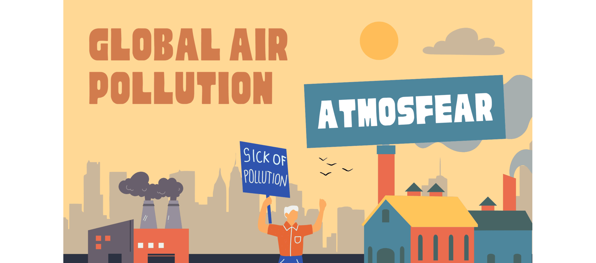

# 

  
**Atmosfear** is a data science group project that explores the global challenge
of air pollution and its impact on public health. Our goal is to uncover patterns
in how different pollutants dominate across world cities and how these patterns
relate to regional trends in respiratory and cardiovascular illnesses. By
identifying these pollutant profiles and their health correlations, we aim to
fill a critical research gap and hopefully support more targeted,
pollutant-specific policy interventions.

---

  
Air pollution is one of the most underestimated killers in the world today.
Unlike more visible threats, polluted air is invisible and easy to ignore until
it becomes personal. You can't see it, but it's there: silently entering lungs,
aggravating asthma, triggering heart conditions, and cutting lives short.

According to the WHO (2023) and GBD (2024), air pollution contributes to an
estimated **7 million premature deaths each year** due to its strong links with
cardiovascular and respiratory diseases, stroke, and lung cancer. It's not just
an environmental crisis; it's a public health emergency hiding in plain sight.

---

  
One of our group members shared a personal story: her mother, who has asthma,
experiences severe discomfort when staying in cities where it is polluted. Even
short visits can mean weeks of relying on medications, constant coughing, and
the simple wish to breathe without pain. For her and millions with similar and
different health conditions, clean air isn’t just a preference, it’s a necessity.

**But is it feasible to find cities where the air is truly safe for vulnerable
individuals?**  
[Link here](#) <!-- Replace # with the actual link -->

---

  
A brief overview of our shared insights on global air pollution, its health impacts,
and why a deeper pollutant-specific analysis is needed.

*Located in the `0_domain_study` folder — [`sum_of_group_understanding.md`](0_domain_study/sum_of_group_understanding.md)*

---

  
A focused review of key pollutants, global exposure trends, and the limitations
of current metrics like the AQI.

*Located in the `0_domain_study` folder — [`background_review.md`](0_domain_study/background_review.md)*

---

  
Among the top global cities with the highest average AQI in **(Timeframe)**,
how do respiratory and cardiovascular hospitalization rates differ based on the
city’s dominant air pollutant?

---

<!-- Add your team members creatively here! -->
